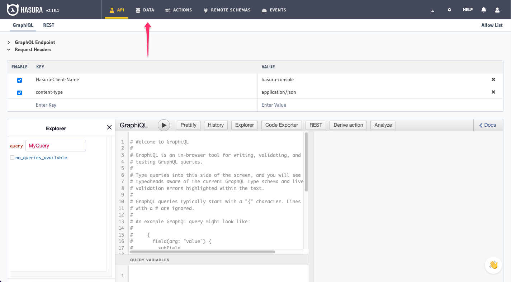

# Docker Postgresql

This repository provides a collection of scripts to set up and deploy a Docker environment on a Raspberry Pi 400 running Ubuntu server from MacOS. These scripts automate Docker installation, fetch and deploy a `docker-compose.yml` file to start Hasura GraphQL Engine and a Postgres database, and guide the user through connecting the database using the Hasura console.

## Structure

`pi_local.sh`: This script connects to a Raspberry Pi 400 running Ubuntu Server, synchronizes the local directory with the Pi, then executes Docker installation and deployment commands on the Pi. It installs Homebrew and Rsync on your local machine, and executes the `install_docker.sh` and `hasura.sh` scripts.

`install_docker.sh`: This script installs Docker on the Raspberry Pi server. It updates the package list, installs Docker packages, Docker GPG key, Docker repository, Docker Engine, containerd, and Docker Compose.

`hasura.sh`: This script deploys Hasura GraphQL Engine and Postgres database using Docker Compose. It downloads the `docker-compose.yml` and then starts the Hasura GraphQL Engine and Postgres database in Docker containers.

## Prerequisites
Raspberry Pi 400 running Ubuntu server.
SSH access to Raspberry Pi.
The hostname of your Raspberry Pi set to `pi`.

Set the PI_HOST variable to the IP address of your Raspberry Pi and run the pi_local.sh script:
```bash
PI_HOST=$(dig +short pi | tail -n1) bash pi_local.sh
```
This will connect to the Raspberry Pi, synchronize files, install Docker, and deploy the Hasura GraphQL Engine and a Postgres database.

## Connect a Database
To connect a database to your Hasura instance, follow these steps:

1. Open the Hasura Console by navigating to http://pi:8080/console.



2. From the Console, click the Data tab.

3. Select the Environment Variable option and enter `PG_DATABASE_URL` as the environment variable name.


4. Click Connect Database.

## Create a Table and Insert Some Demo Data
To create a table and insert data, follow these steps:

1. On the Hasura Console, navigate to Data -> Create table and create a sample table called profiles with the following columns and add a table comment:

```sql
profiles (
  id SERIAL PRIMARY KEY, -- serial -> auto-incrementing integer
  name TEXT
)
```


2. Now, insert some sample data into the table using the Insert Row tab of the profiles table.

## Try Out a Query
You can test your setup by running a query to fetch data from your newly created table.

Head to the API tab in the Console and try running the following query:

```graphql
query {
  profiles {
    id
    name
  }
}
```

Execute the query. You'll see that you get all the inserted data.


